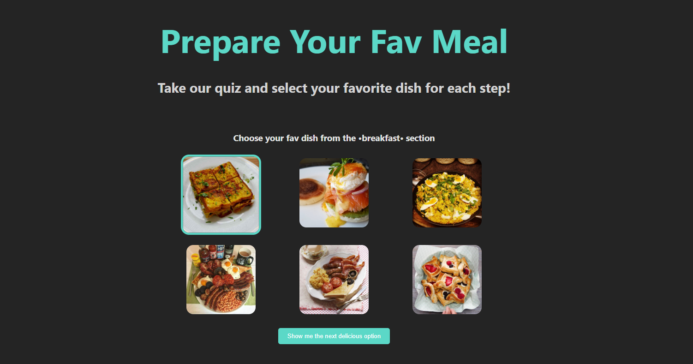

<p align="center">
   
</p>

<h1 align="center">Prepare Your Fav Meal</h1>

<h2 align="center">About 📖</h2>

<p align="left">
  Welcome to Prepare Your Fav Meal – a fun and interactive quiz that helps you prepare your perfect meal! 🍽️✨
</p>

<p align="left">
  In this game, you’ll choose your favorite dish from six different categories – like desserts, pasta, chicken, and more! For each section, simply pick the meal that makes your mouth water the most. At the end of the quiz, all your chosen meals will be displayed together, revealing your ultimate meal lineup! 😋
</p>

<p align="left">
  Built with React, TypeScript, and Vite, Meal Finder is designed for a smooth and engaging experience. We use Atomic Design principles to ensure a modular and maintainable structure, and SCSS to bring a sleek and stylish touch. Plus, all meal data comes straight from the <a href="https://www.themealdb.com/api.php?ref=apilist.fun">TheMealDB API</a>, so you get real-world meal inspiration!
</p>
<br>

---

<h2 align="center">Preview 💻</h2>

<p align="center">
   
</p>

---

<h2 align="center">Technologies 🚀</h2>

- [React](https://react.dev/)
- [TypeScript](https://www.typescriptlang.org/)
- [Vite](https://vitejs.dev/)
- [SCSS](https://sass-lang.com/)
- [Jest](https://jestjs.io/)

---

<h2 align="center">How to Use 🤔</h2>

```bash
# Clone this repository:
$ git clone https://github.com/leclm/PrepareYourFavMeal.git

# Enter the directory:
$ cd prepareyourfavmeal

# Install dependencies:
$ npm install

# Start the development server:
$ npm run dev

# Open your browser at:
http://localhost:5173/
```

---

<h2 align="center">How to Run Tests 🧪</h2>

```bash
# Run unit and integration tests:
$ npm run test
```

---

<h2 align="center">How to Contribute 💪</h2>

```bash
# Fork the project

# Create a new branch with your changes:
$ git checkout -b my-feature

# Save your changes and create a commit message:
$ git commit -m "feat: My new feature"

# Submit your changes:
$ git push origin my-feature
```

---

<h2 align="center">License 📝</h2>

<p align="center">
   This repository is under MIT license. You can see the <a href="https://github.com/yourusername/mealfinder/blob/main/LICENSE">LICENSE</a> file for more details. 😉
</p>

---

>This project was developed by **[@Letícia Lima](https://www.linkedin.com/in/leticiachagaslima/)**, as a way to improve my knowledge and practice 💜

---

<div align="center">

[](https://www.linkedin.com/in/leticiachagaslima/)

</div>